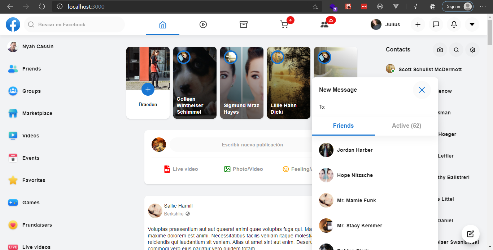

    

 

    This is a web application of Clone UI Facebook :busts_in_silhouette: created with ReactJS. 

    

 

## Preview

## Screens

- [x] [Index](https://facebook-clone-dev.vercel.app)
- [x] [Groups](https://facebook-clone-dev.vercel.app/groups)
- [x] [Marketplace](https://facebook-clone-dev.vercel.app/marketplace)
- [x] [Gaming](https://facebook-clone-dev.vercel.app/gaming)
- [x] [Stories](https://facebook-clone-dev.vercel.app/stories)
- [x] [Users](https://facebook-clone-dev.vercel.app/users/1)
- [x] [Search](https://facebook-clone-dev.vercel.app/search)
- [x] [Watch](https://facebook-clone-dev.vercel.app/watch)
- [x] [404](https://facebook-clone-dev.vercel.app/404)
- [x] [Pages](https://facebook-clone-dev.vercel.app/pages)
- [x] [Weather](https://facebook-clone-dev.vercel.app/weather)
- [ ] [Photos](https://facebook-clone-dev.vercel.app/photos/1)
- [ ] [User Photos](https://facebook-clone-dev.vercel.app/users/1/photos)
- [ ] [Messages](https://facebook-clone-dev.vercel.app/messages/1)
