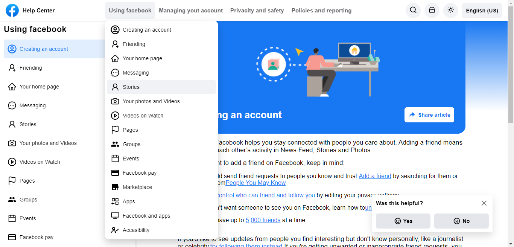

# Facebook help

    

 

 This is a web application of Clone UI Facebook created with ReactJS. 

<strong>
<a href="https://facebook-help.surge.sh" >DEMO</a>
</strong>

## Available Scripts

In the project directory, you can run:

### `yarn start`

Runs the app in the development mode.\
Open [http://localhost:3000](http://localhost:3000) to view it in the browser.

### `yarn build`

Builds the app for production to the `build` folder.
